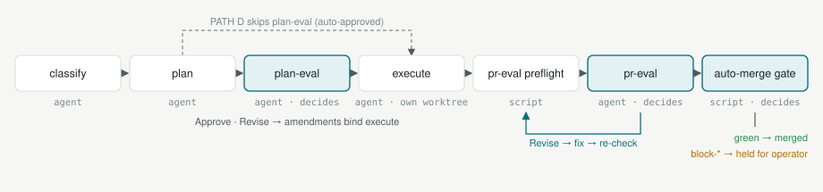
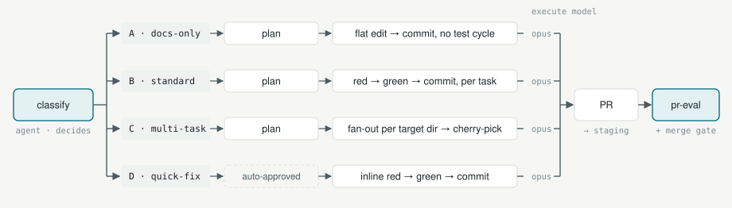
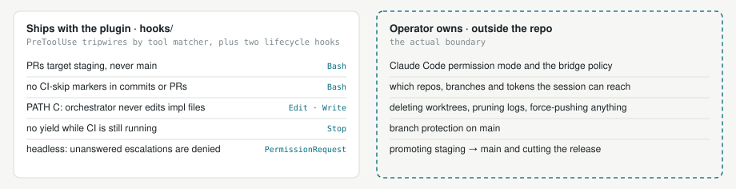
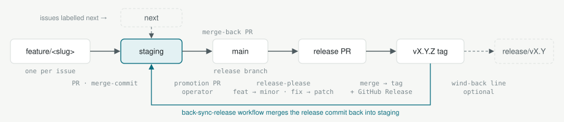

# Pipeline

> Harness and orchestrator for GitHub-issue-driven CI workflows on Claude Code

[](LICENSE)
[](https://github.com/rjskene/pipeline/actions/workflows/ci.yml)
[](#install--first-run)

Pipeline takes a GitHub issue from filed to merged through automated stages. Every stage is a slash command, every decision point is a script or an independent reviewer with its own context, every change happens in its own git worktree, and anything the reviewers will not sign off on is held for a human.

```
create → classify → plan → eval → execute → eval-pr → merge
```

Full process maps in docs/process-maps.md.

## Canonical entry points

| Command | When to use |
|---|---|
| `/pipeline:status` | Read-only survey: what is ready, in progress, or awaiting review, plus housekeeping (`/pipeline:run` remains as a deprecated alias) |
| `/pipeline:fullsend [N ...]` | Autonomous end-to-end run for one or many issues; `--campaign` partitions the slate into cost-bounded legs; `--manual-merge` keeps the merge in your hands |
| `/pipeline:campaign [N ...]` | Standalone entry to the same coordinated-leg loop as `/pipeline:fullsend --campaign`; `--max-bc=N` / `--max-ad=N` override the per-leg caps |
| `/pipeline:hotfix "<problem>"` | Emergency lane: an in-session worktree fix that bypasses the lifecycle gates; you watch the test/fix loop and merge by hand |
| `/pipeline:analyze-issues` | Read-only hygiene pass: duplicate / tracker-fit / missing-label / supersession detection |
| `/pipeline:init` | Bootstrap a fresh project: preflight deps, detect repo and branch, generate the gitignored `pipeline.config`, seed labels, doctor audit |

Full command catalogue (every skill, all flags, interaction surfaces): [docs/skills-api.md](docs/skills-api.md).

## How a run flows

<picture>
  <source media="(prefers-color-scheme: dark)" srcset="docs/assets/lifecycle-dark.svg">
  
</picture>

| Stage | Who | What it produces | Label after |
|---|---|---|---|
| classify | agent | `## Classification` comment and the path label (`docs-only` / `multi-task` / `quick-fix`; none means PATH B) | (none) |
| plan | agent | `## Implementation Plan` comment | `plan-pending` |
| plan-eval | agent, independent context | Approve or Revise. Under the default `annotate` gate a Revise binds its amendments into execute instead of re-planning | `plan-reviewed` → `plan-approved` |
| execute | agent, own worktree | conventional commits on `feature/<slug>` and a PR against the base branch | `in-progress` → `pr-open` |
| pr-eval preflight | script | one line covering CI state, base branch, guard scan and body contract; a fatal arm skips the model review entirely | `pr-open` |
| pr-eval | agent, independent context | verdict comment; may fix and re-check | `pr-open` |
| auto-merge gate | script | merge on green, or hold with a `block-*` reason for the operator | `merged` |

Lifecycle labels are flipped through `scripts/transition-issue.sh`, so a permission classifier sees one opaque script call instead of a raw label edit. Plan approval is automatic inside `fullsend`; `PIPELINE_PLAN_GATE=full` restores the explicit evaluate → re-plan loop and `none` skips the gate.

## Paths

<picture>
  <source media="(prefers-color-scheme: dark)" srcset="docs/assets/paths-dark.svg">
  
</picture>

| Path | Label | Execution | Review gates |
|---|---|---|---|
| A docs-only | `docs-only` | flat edit → commit, no test cycle | plan-eval + pr-eval |
| B standard | (none) | one execute agent, red → green → commit per plan task | plan-eval + pr-eval |
| C multi-task | `multi-task` | one `tdd-implementer` per `target=<dir>` leaf, each in its own worktree, cherry-picked back onto the feature branch | plan-eval + pr-eval |
| D quick-fix | `quick-fix` | inline red → green → commit in the orchestrator session; the plan is auto-approved | pr-eval |

The classifier picks the cheapest path that fits; a `<!-- pipeline:path=D -->` body marker forces D. Every path executes on Opus by default, and the pr-eval reviewer is never tier-dropped below the executor. PATH C fans out inline by default; `--spawn` reverts it to the headless run-queue transport.

## What a run looks like

Two issues, one `/pipeline:fullsend 1352 1353`, condensed:

```
usage-gate: decision=proceed five_hour=41 seven_day=23 threshold=85 resume_at=
Wave 1: classify #1352, #1353 in parallel
Wave 1: plan #1352, #1353 in parallel
plan-eval   #1352 Approve · #1353 Revise → annotate: amendments bound into execute
Wave 1: execute #1352 (B, opus) #1353 (B, opus) in parallel   wt-1352-hook-denial-log  wt-1353-prune-logs
PR #1354 → staging · PR #1355 → staging
PREFLIGHT=ok REASON=none PR=1354 FIXED=none · PREFLIGHT=ok REASON=none PR=1355 FIXED=none
pr-eval     #1354 Approved · #1355 Approved
auto-merge  #1354 green → c0c0d3f · #1355 green → 838580b
```

When the five-hour budget crosses the threshold the first line reads `decision=pause-5h` and the run arms a recurring re-check cron instead of burning into the wall. See [docs/usage-gate.md](docs/usage-gate.md).

## Trust and permissions

<picture>
  <source media="(prefers-color-scheme: dark)" srcset="docs/assets/trust-dark.svg">
  
</picture>

The plugin ships no path or deletion guard. Those hooks were retired once a week of data showed dozens of false denials and zero true catches; what remains are narrow tripwires over pipeline rules a permission classifier cannot know. The real boundary is the operator's Claude Code permission mode, sandbox and token scope. Headless runs (`claude -p`) no longer skip permissions: they run under auto mode with a `PermissionRequest` bridge that queues each escalation for a human and denies it if nobody answers. Untrusted issue comments and attachments are read through `scripts/filter-trusted-comments.sh`; the hook that enforces that path is registered on this repo's dogfood install only. Full reasoning in [docs/security-model.md](docs/security-model.md).

## Branches and releases

<picture>
  <source media="(prefers-color-scheme: dark)" srcset="docs/assets/branches-dark.svg">
  
</picture>

- `staging` is the base branch (`PIPELINE_BASE_BRANCH`). Feature PRs land there by merge-commit, so each PR becomes one CHANGELOG line.
- `main` is the release branch. A promotion PR moves staging to main; release-please then opens the version PR, and merging it cuts the tag and GitHub Release. The back-sync workflow merges the release commit back into staging.
- An issue labelled `next` has its PR routed onto the `next` integration branch for breaking-change work; `release/vX.Y` branches are optional wind-back lines. Procedure in [docs/release-cadence.md](docs/release-cadence.md).

## Cost and observability

- **Models.** Execute runs on Opus for every path; `PIPELINE_PATH_{A,B,C,D}_MODEL_EXECUTE=sonnet` opts a path back into the cheap lane. PATH C plans on Fable because a bad cross-worktree split is the most expensive failure. On PATH B and D the high-uncertainty carve-out (security, auth, concurrency, migration, data-loss vocabulary) pins Opus regardless of knob, and pr-eval is never tier-dropped.
- **Usage gate.** Real account usage from the `/usage` endpoint gates every wave: pause at the 5-hour threshold with auto-resume, hard halt at the 7-day one. Fail-open, with a kill switch. See [docs/usage-gate.md](docs/usage-gate.md).
- **Tokenomics.** `/pipeline:tokenomics` renders cost and latency per bucket, stage, structure and path from the gated `agent-costs.jsonl` log (dogfood-only). See [docs/observability.md](docs/observability.md) and [docs/cost-architecture.md](docs/cost-architecture.md).
- **Logs.** Nothing is written under `.claude/logs/` unless `PIPELINE_LOGS_ENABLED=true`; `scripts/prune-logs.sh` is the dry-run-by-default retention pass.

## Dogfood only

This repo runs the plugin against its own working tree. Three things exist only here:

- **Evolve loop.** `/pipeline:evolve start` drives observe → diagnose → file → fullsend → measure → decide cycles on the `evolve` integration branch, with one retro per cycle under [docs/retros](docs/retros/README.md).
- **Calibration.** `scripts/calibration-run.sh` replays a fixed six-issue slate against a sandbox repo headlessly and emits one `CALIB-TOTAL` line per run, archived under `docs/retros/calib/`. Every retool lands there before it ships. See [docs/calibration.md](docs/calibration.md).
- **Observability hooks.** Tool-use, subagent and cost-capture hooks live in this repo's `.claude/settings.json`, not in the published plugin manifest. See [docs/dogfood-setup.md](docs/dogfood-setup.md).

## Install + first run

- Marketplace add:
  ```
  /plugin marketplace add rjskene/pipeline
  ```
- Install:
  ```
  /plugin install pipeline@claude-pipeline
  ```
  Registers all slash commands, hooks, skills, and the `tdd-implementer` subagent. Lives at `~/.claude/plugins/claude-pipeline/` (runtime `${CLAUDE_PLUGIN_ROOT}`).
- Init (recommended):
  ```
  /pipeline:init
  ```
  Bootstrap a fresh project — preflight deps / detect repo+branch / generate gitignored `pipeline.config` / seed labels / doctor audit. Greenfield counterpart to `scripts/migrate-from-subtree.sh`.
- Configure (manual alt to init) — create `pipeline.config` at repo root:
  ```bash
  PIPELINE_REPO="your-org/your-repo"
  PIPELINE_BASE_BRANCH="staging"
  PIPELINE_WORKTREE_PREFIX="wt"
  PIPELINE_INSTALL_CMD="npm ci"
  PIPELINE_TEST_CMD="npm test"
  PIPELINE_TYPECHECK_CMD="npx tsc --noEmit"
  PIPELINE_CONTEXT_FILES="CLAUDE.md"
  ```
  See `pipeline.config.example` for all options.
- Validate:
  ```
  /pipeline:doctor
  ```
  Read-only audit; `--fix labels` seeds canonical labels idempotently.
- First run:
  ```
  /pipeline:status
  ```
  (`/pipeline:run` remains as a deprecated alias for `/pipeline:status`.)

## Project layout

```
claude-pipeline/
├── skills/         # Pipeline slash-command skills (status, fullsend, plan-issue, evolve, ...)
├── agents/         # Subagent definitions (tdd-implementer)
├── hooks/          # PreToolUse / Stop / PermissionRequest hook scripts
├── scripts/        # Shell helpers invoked by skills and hooks
├── docs/           # System-reference docs; docs/assets holds the rendered README diagrams
├── dev/            # Dogfood-only tooling (calibration slate, dogfood hooks, diagram renderer)
├── tests/          # Test substrate for scripts, hooks, and skill contracts
├── .github/        # Workflows (ci, release-please, back-sync-release), issue templates
├── pipeline.config # Host-specific config (gitignored; copy from pipeline.config.example)
├── CLAUDE.md       # Working instructions for agents operating in this repo
└── README.md       # This file
```

## Where to look

| Question | Read |
|---|---|
| Which command, which flag, which label or knob | [docs/skills-api.md](docs/skills-api.md) |
| Lifecycle, paths, waves, campaign legs | [docs/process-maps.md](docs/process-maps.md) |
| Dispatch model, worktrees, base-branch enforcement | [docs/architecture.md](docs/architecture.md) |
| What the hooks do and do not protect | [docs/security-model.md](docs/security-model.md) |
| Releases, promotion, back-sync, rollback | [docs/release-cadence.md](docs/release-cadence.md) |
| Plugin layout, `CLAUDE_PLUGIN_ROOT`, doctor states | [docs/plugin-architecture.md](docs/plugin-architecture.md) |
| Cost decisions and the model-tier record | [docs/cost-architecture.md](docs/cost-architecture.md), [docs/analysis/model-downsampling.md](docs/analysis/model-downsampling.md) |
| Operator playbook: wedges, hand-driving scripts, headless runs | [docs/operational-notes.md](docs/operational-notes.md) |
| Greenfield setup, migrating off the old subtree install | [docs/getting-started.md](docs/getting-started.md), [docs/migration-from-subtree.md](docs/migration-from-subtree.md) |

Authoritative behavior for each command is its `skills/<name>/SKILL.md`; `CLAUDE.md` holds the working rules for this repo.

## Prerequisites

### System binaries

- `gh` CLI — for GitHub issue/PR operations.
- `jq` — for hook JSON parsing.
- `bash` 4+ — queue and status scripts use associative arrays. (Note: macOS ships bash 3.2; `brew install bash`.)
- `python3` — the hook scripts.
- `tmux` — the `--spawn` run-queue transport; `/pipeline:init` preflight checks for it.
